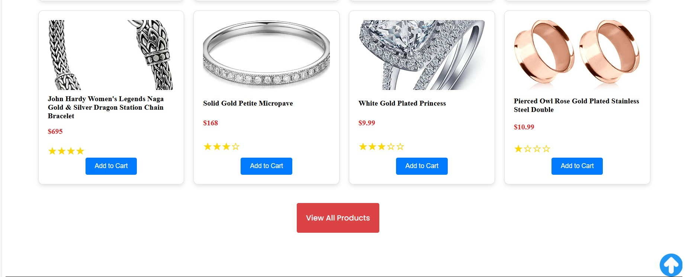
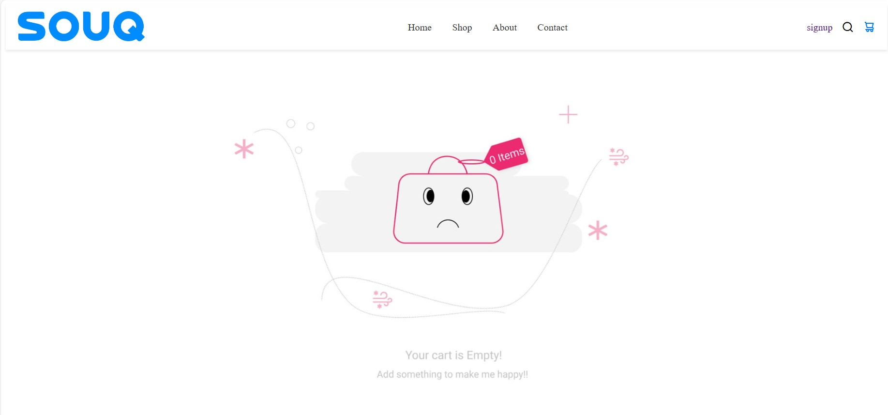
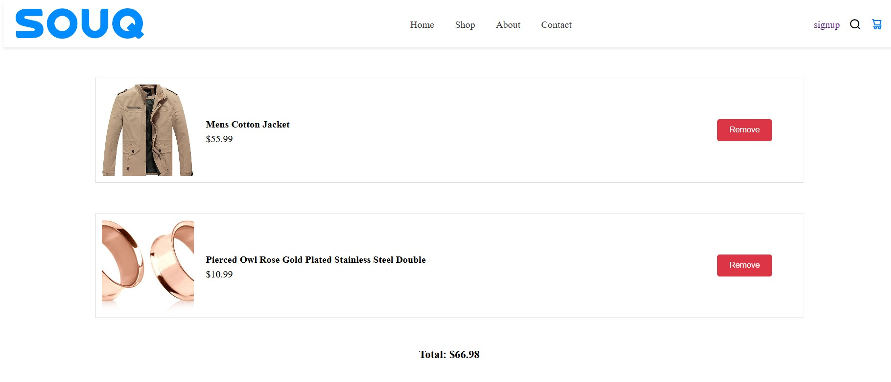
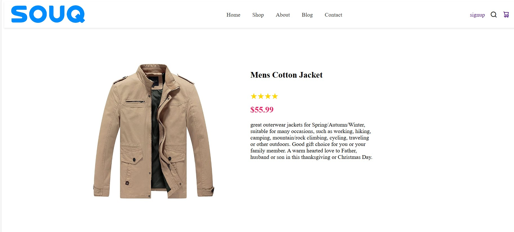
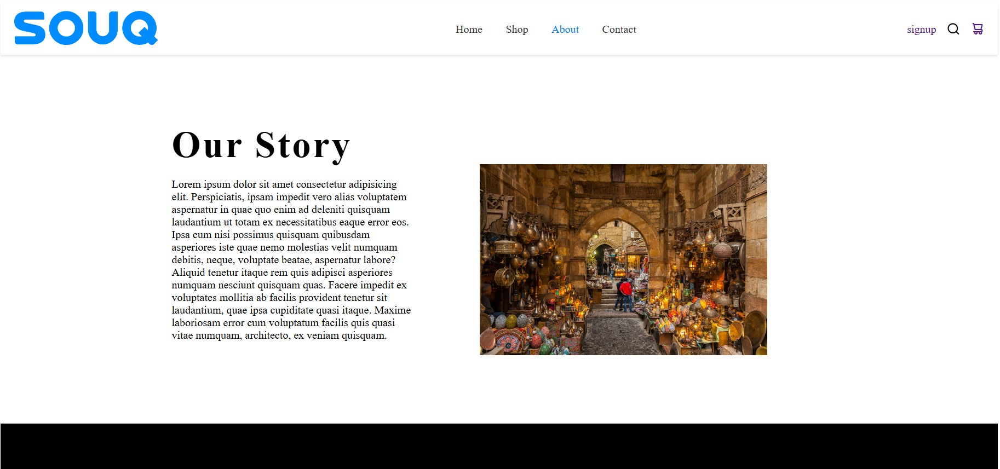

# E-Commerce-Website

## Table of Contents
1. [Sign Up Page](#sign-up-page)
2. [About the App](#about-the-app)
3. [Home Page](#home-page)
4. [Cart Page](#cart-page)
5. [View Product Page](#view-product-page)
6. [Shop Page](#shop-page)
7. [About Page](#about-page)

## About the App

This e-commerce website is a marketplace developed using HTML, CSS, and JavaScript. It includes various pages for browsing products, viewing product details, managing a shopping cart, and more.

## Sign Up Page

The sign-up page allows new users to create an account by providing their personal information and setting up login credentials.

## Home Page

The home page features a slider with promotional images, navigation to other pages, and a showcase of new products.

## Cart Page

The cart page allows users to view the products they have added to their shopping cart.

## View Product Page

On the view product page, users can see detailed information about a specific product, including images, descriptions, and pricing.

## Shop Page

The shop page displays a grid of products available for purchase. 

## About Page

The about page provides information about the marketplace.

